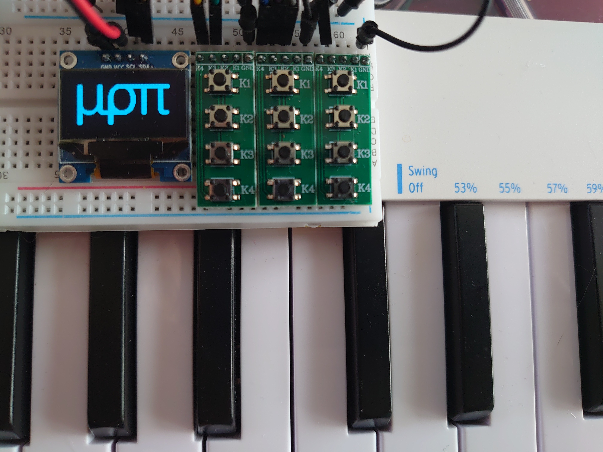

# μρπ (miropi)
MIDI Router on Raspberry Pi

Work in progress. For now that's just a repository to track changes, but I plan to develop it to easy to install system. Feel free to try it out (clone this repository, figure out dependencies, start via `./run.sh`) and ask questions.

## Hardware
- Raspberry Pi: tested and developed on Pi Zero, so any regular Pi should work. Pi Pico version is a long-term goal, probably will need rewriting everything
- Screen: ssd1306 128x64
- 7 buttons: 5-way navigation, escape key, options key
- USB hub, so you can connect multiple MIDI devices: either Raspberry Pi USB Hub Hat or a regular USB hub. Getting a independently powered one is recommended
