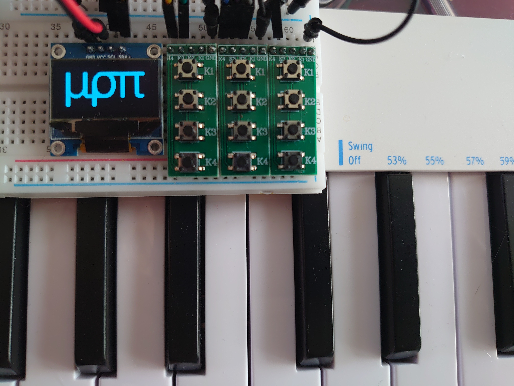
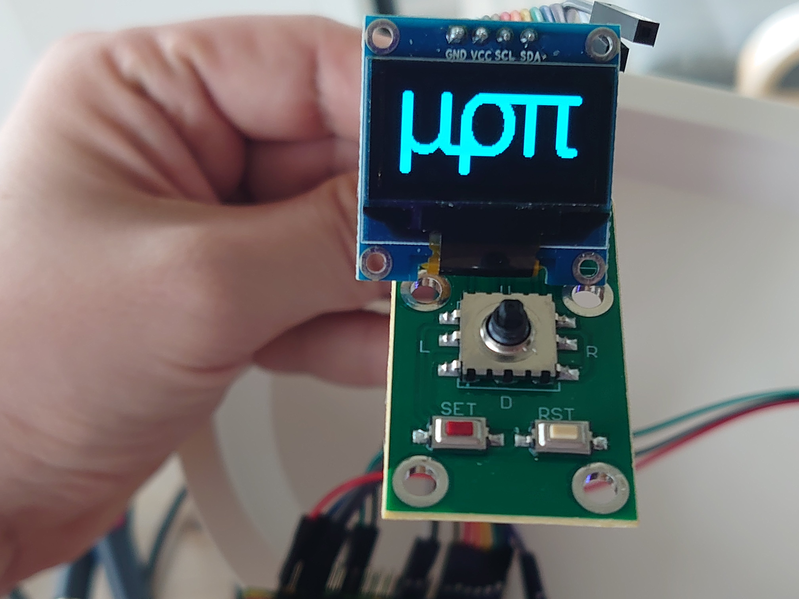
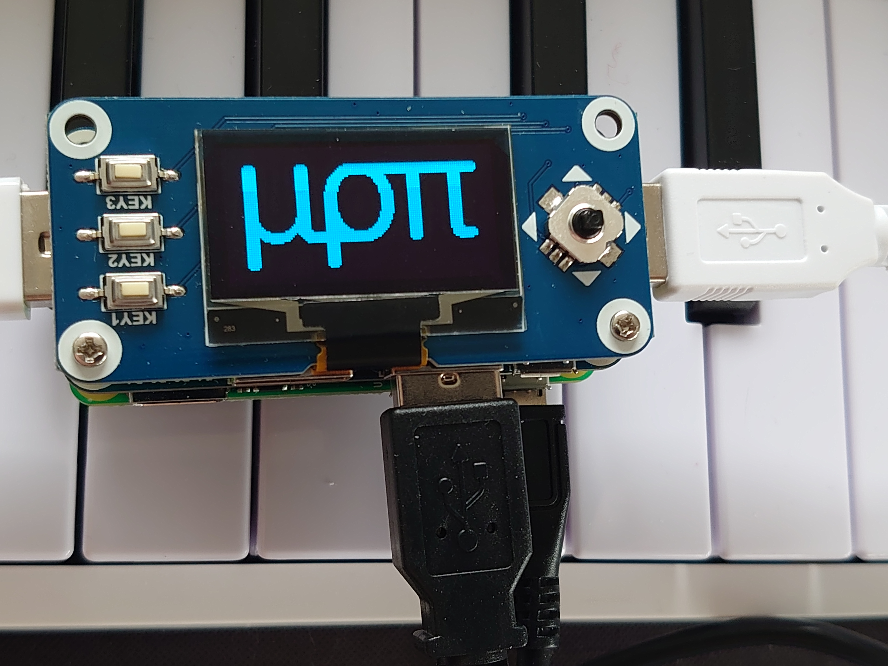

# μρπ (miropi)
MIDI Router on Raspberry Pi

Work in progress. For now that's just a repository to track changes, but I plan to develop it to easy to install system. Feel free to try it out (clone this repository, install dependencies, start via `./run.sh`) and ask questions.

## Hardware
- Raspberry Pi: tested and developed on Pi Zero, so any regular Pi should work. Pi Pico version is a long-term goal, probably will need rewriting everything
- Screen: in theory any display [`luma`](https://luma-oled.readthedocs.io/en/latest/) is supporting, but developed and tested on monochorme oled 128x64 (ssd1306 via i^2c and sh1106 via SPI) 
- 6 buttons: 5-way navigation, escape key
- USB hub, so you can connect multiple MIDI devices: either Raspberry Pi USB Hub Hat or a regular USB hub. Getting a independently powered one is recommended

## Software
`pip3 install luma.oled luma.lcd mido python-rtmidi`

## Interface versions
Just some photos of different screens and buttons tested

